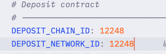
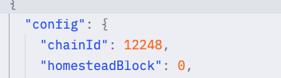

## 环境准备
- 执行script/download-bin.sh 下载erigon和prysm
- 执行secret/network1-keys.sh, 将network-keys拷贝到/data/beacon，三个脚本对应三个节点，在不同的三个服务器执行

## 开放端口
- P2P： 13000/TCP、13000/UDP、12000/UDP、30303/TCP、30303/UDP
- beacon-http-port：3500端口可以控制指定ip访问，因为需要获取finalized的返回值->>curl -s http://159.138.146.42:3500/eth/v1/beacon/headers/finalized, 创世节点还需要让其他节点通过3500端口同步区块
- erigon-http-rpc: 8545端口通常开放给自家的服务，例如浏览器、钱包、前端、rpc方法访问，可以选择完全开放(有安全风险)或者限制ip、或者使用代理

## 创建Nodekey
- 具体内容阅读[create_nodekey.txt]
- 按部署的节点数量生成，nodekey的作用是保证erigon的enode地址的唯一和不变，enode是节点的唯一标识符，用于在P2P网络中进行通信和身份验证。每个节点的enode地址由nodekey生成，格式为enode://<public_key>@<ip_address>:<port>，其中public_key是nodekey的公钥，ip_address是节点的IP地址，port是节点的端口号。

## 创建peerID
- 具体内容阅读[create_peerID.txt]
- peerID是共识层prysm的唯一标识符，用于在P2P网络中进行通信和身份验证。也是按部署的节点数量生成，生成peerID与节点匹配，不能重复使用
```bash
note:保证peerID不变,需要将network-keys拷贝到/aec-testnet/data/prysm/下，即使要清理数据，也不要删除network-keys
```

## 创建验证者地址
- 阅读wallet-import.txt和gensis.txt,并且了解deposit的安装和使用，生成的地址数量需要添加到network/mnemonics.yaml的count，使用的助记词添加到mnemonics.yaml的mnemonic字段
- 如果还没有生成过地址的，也没有助记词，可以使用deposit new-mnemonic，生成助记词和地址
- 如果已有助记词，需要按索引使用deposit生成对应的秘钥，使用
```bash
deposit existing-mnemonic --folder ./validator_keys --validator_start_index 10 --num_validators 90
```
  - validator_start_index是验证者秘钥的起始索引，10带边前边已经生成了0-9一共10个秘钥，当前从索引10开始生成
  - num_validators是生成数量，从索引10生成开始生成90个
  - folder是验证者秘钥的存储路径
- 假设我们生成100个验证者地址，有100个秘钥，deposit生成秘钥需要使用validator来转成符合prysm的秘钥格式，使用
```bash
validator --accept-terms-of-use=true --chain-config-file=/opt/eva-testnet/network-configs/config.yaml accounts import --keys-dir=/opt/eva-testnet/keys-three/validator_keys --wallet-dir=/opt/eva-testnet/wallets/wallets_three --wallet-password-file=/opt/eva-testnet/wallets/pwd-three.txt --account-password-file=/opt/eva-testnet/prysm-password/prysm-password.txt
```
  - keys-dir是deposit existing-mnemonic指定验证者秘钥的存储路径
  - wallet-dir是validator将deposit生成秘钥转成符合prysm的存储路径，会记录哪些账户已导入，以及密钥的加密存储形式
  - wallet-password-file指定一个文件，里面保存钱包的密码，用于 解锁钱包。这样 validator 在启动时不会提示你手动输入密码，可以自动化运行
  - account-password-file指定一个文件，里面保存账户的密码，用于 解密账户私钥
- 你的keys-dir有多少个秘钥数量，就有多少个验证者地址，假设我们制定链100个验证者地址，在执行validator命令时，你向keys-dir添加多少个验证者秘钥用于当前节点，当前节点就有多少个验证者
- 创世节点生成的区块验证通过，后续节点才能同步，所以给创世节点分配的秘钥数量要大于总数的2/3，100个就要70个分给验证节点
- 最终我们只使用wallet-dir路径下的
```
note:由于链需要验证者在线数量要满足大于总数的2/3，创世节点生成的区块才能验证通过，后续节点才能同步，所以给创世节点分配的秘钥数量要大于总数的2/3
```

## 生成创世信息
- 创世文件在network下，genesis.json和config.yaml,除了链ID修改，其他参数可根据需求改动
- 阅读genesis.txt，需要安装eth-genesis-state-generator，使用eth-genesis-state-generator生成genesis.ssz
- 测试网和主网的链ID不同，需要在genesis.json和config.yaml中修改chain-id
* config文件链ID字段
[](./images/config-chainID.png)
* genesis.json链ID字段
[](./images/genesis-chainID.png)


## 启动创世节点
```bash
cd aec-testnet/
./aec_testnet_init.sh
./start_erigon1.sh
./start_beacon1.sh
./start_validator1.sh
```
- start_erigon1.sh脚本里的--staticpeers和--trustedpeers里面的enode需要根据你生成的来提供
- start_beacon1.sh脚本里--peer参数也需要根据peerid-batch里的提供
- 目前已配置了三个节点的参数，修改对应的ip后，可直接启动
- 创世节点启动后需要等待一段时间后开始出块，出块后读取finalized，返回非0值在往下执行

## 启动其他节点
```bash
cd aec-testnet/
./aec_testnet_init.sh
./start_erigon2.sh
./start_beacon2.sh
./start_validator2.sh
```
- start_erigon0.sh和start_erigon2.sh都是其他节点的启动脚本，主要是--staticpeers和--trustedpeers得值，要配置已知的节点地址
- erigon启动后等到打印[p2p] GoodPeers     eth68=2在往下执行，否则从头开始
