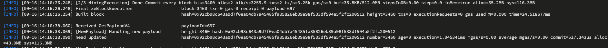

## 环境准备
- 执行script/download-bin.sh 下载erigon和prysm
- 执行secret/network1-keys.sh, 将network-keys拷贝到/data/beacon，三个脚本对应三个节点，在不同的三个服务器执行
- 当前是快速在三台服务器上部署方案，如果有对台需要生成多个network-keys和nodekey.hex,可以查看deploy-ArmoniaEvaChain.md

## 开放端口
- P2P： 13000/TCP、13000/UDP、12000/UDP、30303/TCP、30303/UDP
- beacon-http-port：3500端口可以控制指定ip访问，因为需要获取finalized的返回值->>curl -s http://159.138.146.42:3500/eth/v1/beacon/headers/finalized, 创世节点还需要让其他节点通过3500端口同步区块
- erigon-http-rpc: 8545端口通常开放给自家的服务，例如浏览器、钱包、前端、rpc方法访问，可以选择完全开放(有安全风险)或者限制ip、或者使用代理

## 启动创世节点
```bash
cd aec-testnet/
./aec_testnet_init.sh
./start_erigon1.sh
./start_beacon1.sh
./start_validator1.sh
```
- start_erigon1.sh脚本里的--staticpeers和--trustedpeers里面的enode需要根据你生成的来提供
- start_beacon1.sh脚本里--peer参数也需要根据peerid-batch里的提供
- 目前已配置了三个节点的参数，修改对应的ip后，可直接启动
- 创世节点启动后需要等待一段时间后开始出块，出块后读取finalized，返回非0值在往下执行
```bash
note:启动创世节点后，要等到curl -s http://159.138.146.42:3500/eth/v1/beacon/headers/finalized返回的slot非0在启动下一个节点
```
[](./images/finalized.png)

## 启动其他节点
```bash
cd aec-testnet/
./aec_testnet_init.sh
./start_erigon2.sh
./start_beacon2.sh
./start_validator2.sh
```
- start_erigon0.sh和start_erigon2.sh都是其他节点的启动脚本，主要是--staticpeers和--trustedpeers得值，要配置已知的节点地址

```bash
note:在启动erigon后，要查看日志，看到打印有下图，要pkill erigon，重新执行./aec_testnet_init.sh和./start_erigon2.sh
```
[](./images/goodpeer.png)

## 正常出块如图
[](./images/normal.png)
